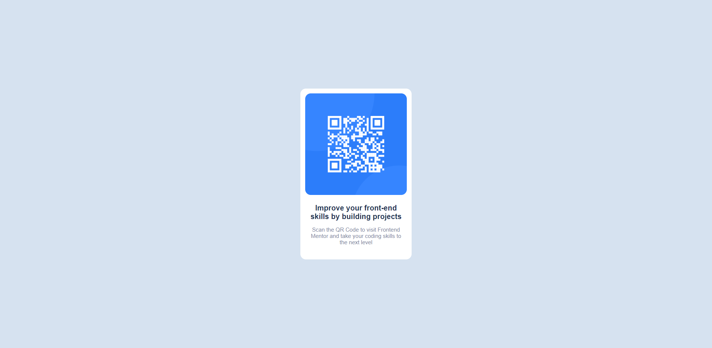

# Frontend Mentor - QR code component solution

This is a solution to the [QR code component challenge on Frontend Mentor](https://www.frontendmentor.io/challenges/qr-code-component-iux_sIO_H). Frontend Mentor challenges help you improve your coding skills by building realistic projects. 

## Table of contents

- [Overview](#overview)
  - [Screenshot](#screenshot)
  - [Links](#links)
- [My process](#my-process)
  - [Built with](#built-with)
  - [What I learned](#what-i-learned)
- [Author](#author)

## Overview

### Screenshot

### Links

- Solution URL: [https://github.com/kamlocicho/qr-code-project](https://github.com/kamlocicho/qr-code-project)
- Live Site URL: [https://qr-code-project-beta.vercel.app/](https://qr-code-project-beta.vercel.app/)

## My process

### Built with

- Flexbox
- CSS Grid
- [React](https://reactjs.org/) - JS library
- [Styled Components](https://styled-components.com/) - For styles
### What I learned

I learnt to use styled components.

## Author

- Website - [Kamil Orwat](https://github.com/kamlocicho)
- Frontend Mentor - [@kamlocicho](https://www.frontendmentor.io/profile/kamlocicho)

**Note: Delete this note and add/remove/edit lines above based on what links you'd like to share.**
